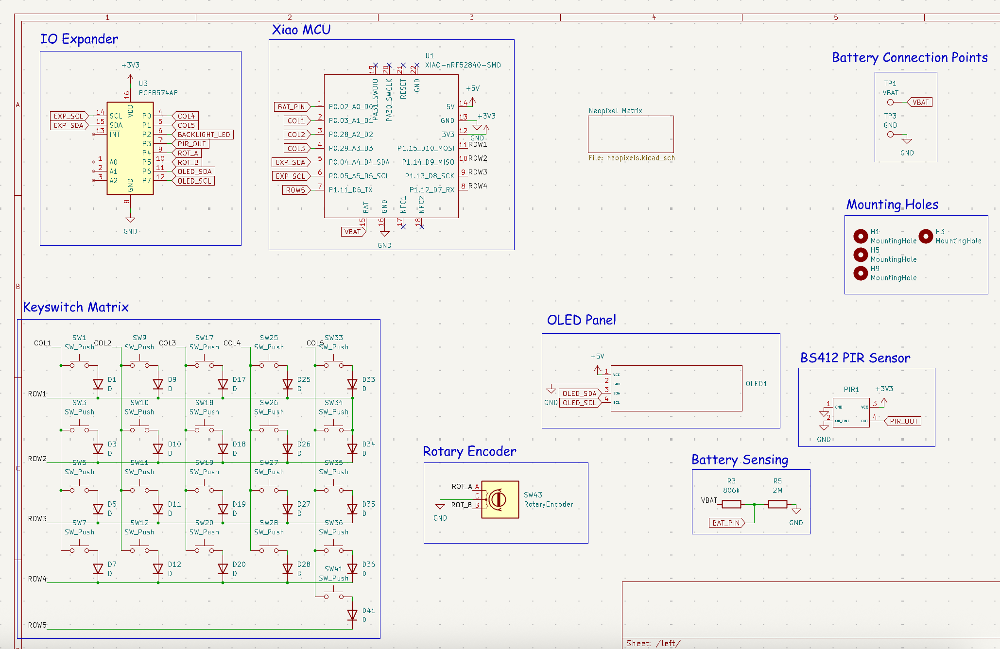
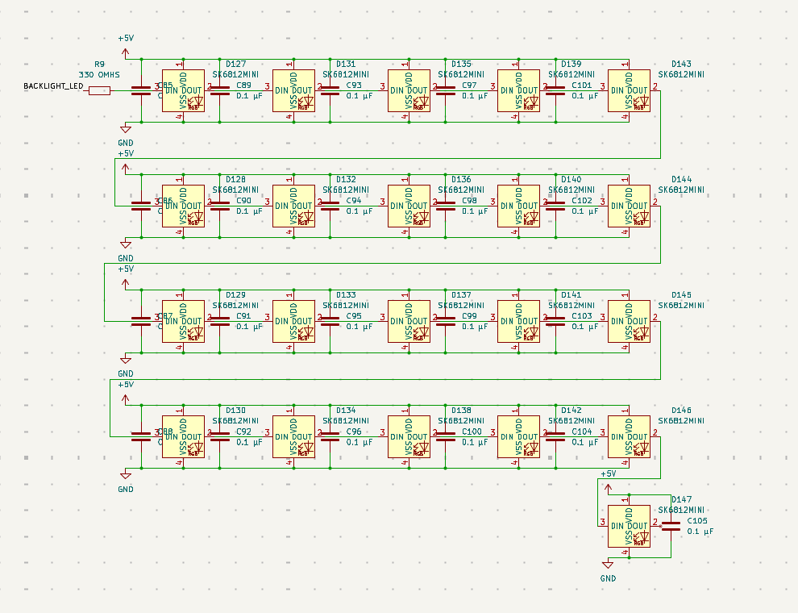
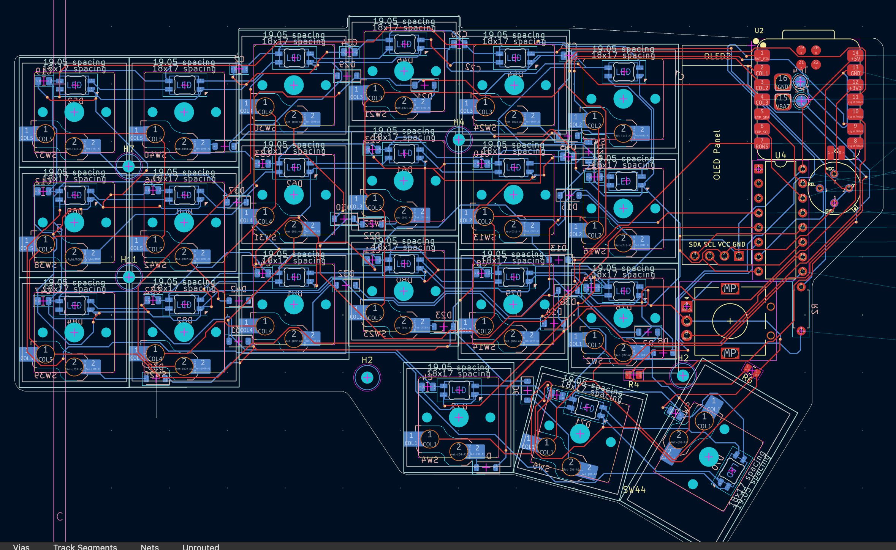
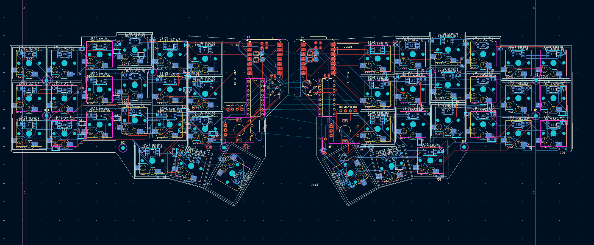
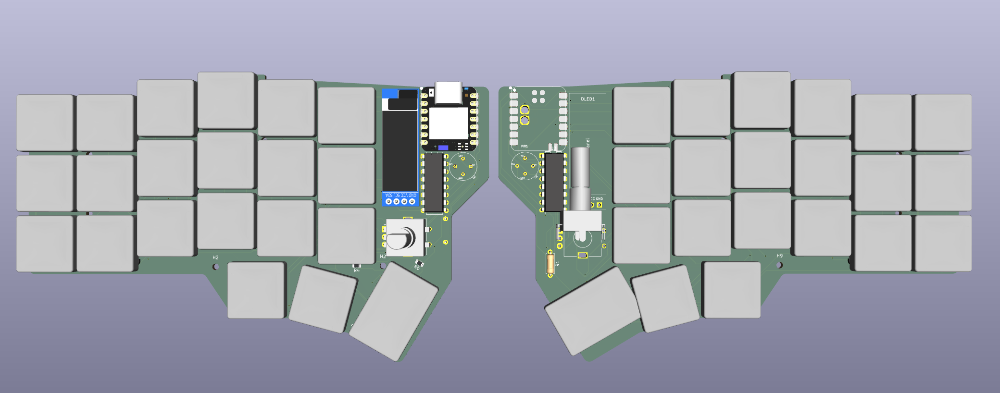
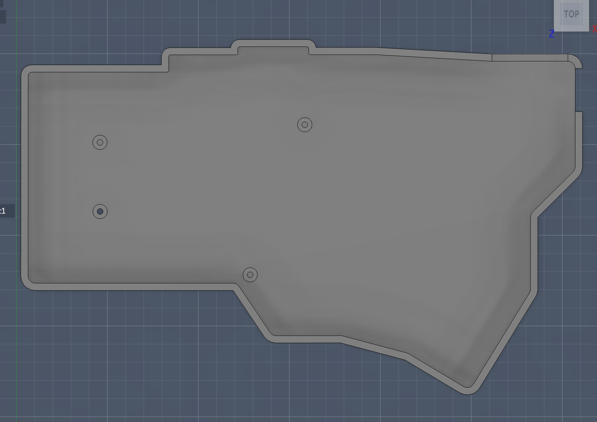
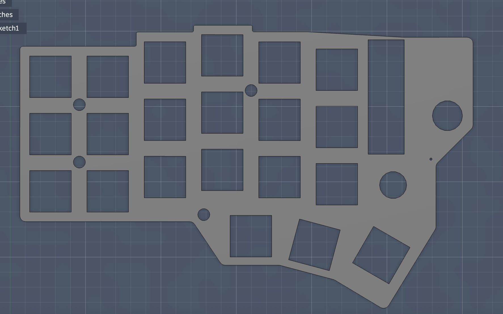
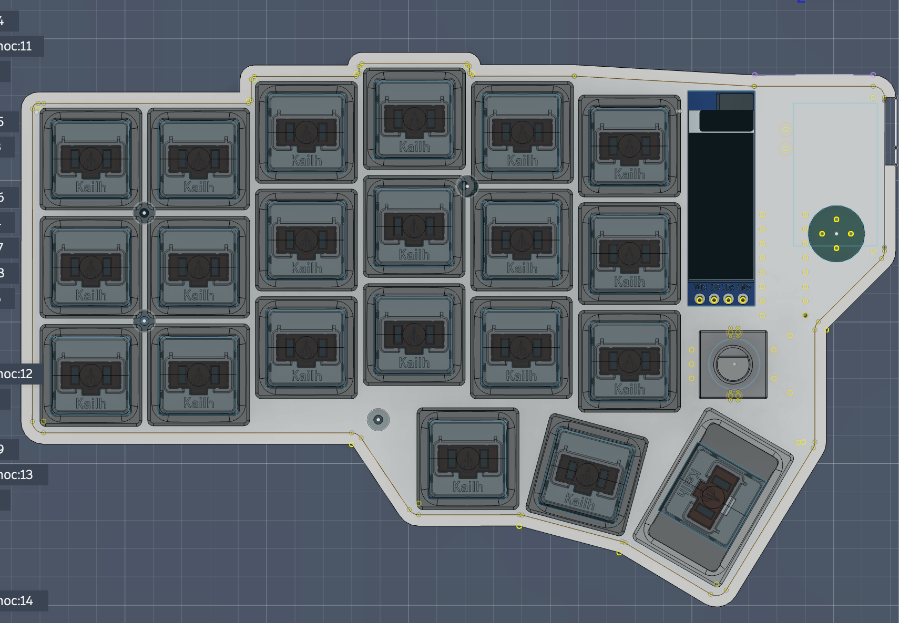

 # The Chillboard
 ## The perfect ergonomic keyboard for chilling
 ## Features
 - Uses Xiao NRF52840 for low power usage and BLE capabilities
 - Wireless design with a 2000 mAh battery and BLE
 - CPG1350 hotswap sockets for customizabilty
 - Low profile choc switches for portability
 - Neopixel backlighting for layer switching
 - OLED panel for battery percentage
 - Tray mounted for easy assembly
 - Rotary encoder for volume control
 - PIR sensor for energy conservation
 - Ortholinear layout with a thumb cluster to reduce strain
## Reasons I built this
 - Right now, I type on a laptop keyboard and am scared that I might get carpal tunnel.
 - The switches on my other keyboard are very loud, and are not the best for me. Hotswap sockets let me customize the feel.
 - The keyboard doesn't have backlighting.
## Schematic
 For the schematic, I used hierarchial sheets to organize everything. There are 2 hierarchial sheets for each side of the pcb, and a hierarchial sheet in each one of those for the large neopixel matrix. 

 - 
 - 
 - 
## PCB
 I designed the PCB with mousebites to make the split keyboard easy to manufacture. I thought of making a reversible PCB at first, but it would be very difficult with an OLED. 
  ### Left side of the PCB 
  
  ### Full PCB
  
  ### 3D View
  
## CAD
 I designed the CAD with ease of assembly in mind. That is why I designed it with no tolerances, so that it could completely friction fit(I added screw holes for the worst case). I decided to print it with an extra fine setting on my Bambu Lab A1 Mini 3D printer, and it turned out great. 
 ### Bottom Case
 
 ### Top Plate
 
 ### Full Assembly
 
## My Zine

## Credits
 This project is inspired by the Corneucopia project by @DynamicWhiteHat.
 It used Autodesk Fusion for CAD, Kicad 10 for the PCB, and is sponsored by Hack Club Fallout! Thanks to Hack Club for sponsoring this!
